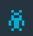

#Managing your Bluemix DevOps Services account

###### Last updated: 22 October 2015

Without signing up for an account in IBM® Bluemix™ DevOps Services, you can explore projects and view the Docs. With an account, you can access all of the features that you need to develop, track, plan, and deploy apps.

* [DevOps Services accounts](#idsaccounts)
* [Setting up a DevOps Services account](#idssetup)
* [Bluemix accounts](#bmaccounts)
* [Table: Free allowance details](#table)
* [Setting up a billing account](#setup)
* [Monitoring your usage](#monitor)

##DevOps Services accounts

After you sign up for a DevOps Services account and set it up, you can do these tasks:

* Develop and deploy software in the cloud
* Host your source code by using built-in source code management tools
* Code in the Web IDE (integrated development environment)
* Track and plan project activities
* Push your apps to Bluemix, the IBM cloud platform
* Collaborate with a team
* Ask questions and get answers in the forum
* Get started quickly by forking a project or completing a tutorial

##Setting up a DevOps Services account

1.	[Sign up for DevOps services](https://hub.jazz.net/). When you sign up, you need to either create an alias or use an existing one. An *alias* is a publicly visible short name. Your alias is included in the URL of each project that you own. The first time you log in to DevOps Services, you link your IBM id with an alias. If you have a Jazz ID, that is used as your alias.
2.	After your IBM id and alias are linked, you can log in to DevOps Services from a web browser or an IBM® Rational Team Concert™ client. In addition, you can access a Git repository from your local Git client.

	* To log in from a web browser, use your IBM id credentials. 
	* To log in from a Rational Team Concert client, use your alias and IBM ID password.
	* To access a Git repository from your local Git client, use your alias and IBM id password.

**Tips:** 
*If you have authentication problems or if you are linked to the wrong account, you can request support by sending an email to <idslogin@jazz.net>. To change the email address of the DevOps Services account that is associated with your IBM id, open your profile, click **PERSONAL INFORMATION**, and update your email address.
*When you update the email address of your DevOps Services account, the email address of the associated IBM id isn’t automatically updated; you must synchronize the accounts. To synchronize the accounts, [update the email address for the linked IBM id](https://www.ibm.com/account/profile/us?page=signinview). If you don't synchronize the accounts, the next time that you log in to DevOps Services, you will be prompted to synchronize them.

##Bluemix accounts

All DevOps Services projects include an allowance of free services. If you exceed your allowances, your work is interrupted. To avoid interruptions, set up a Bluemix billing account and configure your services. By configuring your Bluemix account, you also get advanced features for monitoring your builds, deployments, and the status of your projects. 

If you plan to use the Delivery Pipeline (Build & Deploy) and Track & Plan services beyond the free allowance, configure both services. Each service requires a separate billing configuration.

### Table: Free allowance details
<table border="1" summary="" width="100%">
	<tbody>
		<tr>
			<th>Service</th>
			<th>Charging metric</th>
			<th>Free allowance</th>
			<th>Cost</th>
		</tr>
		<tr style="background-color: #FFFFFF">
			<td rowspan="2">Delivery Pipeline</td>
			<td>Build minutes</td>
			<td>60 minutes per app (project), per month</td>
			<td rowspan="2">See the Bluemix [Pricing page](https://ace.ng.bluemix.net/#/pricing/)</td>
		</tr>
		<tr style="background-color: #FFFFFF">
			<td>App instances (deployers)</td>
			<td>First two app instances (deployers) per app (project), per month</td>
		</tr>
		<tr style="background-color: #EBEBFF">
			<td rowspan="2">Track &amp; Plan</td>
			<td rowspan="2">Users per app</td>
			<td>Private project: Three users</td>
			<td rowspan="2">See the Bluemix [Pricing page](https://ace.ng.bluemix.net/#/pricing/)</td>
		</tr>
		<tr style="background-color: #EBEBFF">
			<td>Public project: Unlimited users</td>
		</tr>
	</tbody>
</table> 

##Setting up a billing account

Before you set up your billing account, determine what the best plan for your project is. [Learn more about billing accounts](https://www.ng.bluemix.net/docs/#acctmgmt/billing.html#bil_plan).

**Important:** The person who is responsible for setting up the billing account might not be the same person who is most affected by build and deployment failures and blocked access to Track & Plan views. If you are not the person who sets up the account, ask your Bluemix billing manager to enable your billing account early.

To set up your billing account, complete these steps: 
1. Go to your Bluemix Dashboard and select the space that is listed in your DevOps Services project settings. 
2. Click **Services** and click **Add a Service or API**.
3. From the DevOps section, select either **Delivery Pipeline** or **Track & Plan**.
4. In the "Add Service" section, make sure that the space that corresponds to your  DevOps Services project is selected.
5. From the **Selected Plan** list, select a billing plan. 
6. Click **CREATE.**

##Monitoring your usage

You can monitor the usage details for your Bluemix account. For more information, [see the billing and usage documentation](https://www.ng.bluemix.net/docs/#acctmgmt/index-gentopic1.html#genTopProcId2). To determine costs, [see the Bluemix Pricing page](https://bluemix.net/#/pricing).

The Delivery Pipeline and Track & Plan services use metered pricing, where you pay based on consumption. However, they also include a free monthly allowance.

To help monitor monthly usage, [see the Bluemix cost estimator](https://ace.ng.bluemix.net/#/pricing/paneId=pricingSheet).

To see your usage details, click **Profile Settings  > Account > Usage Details**.

