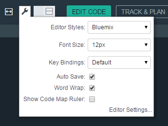

# Editing code in Bluemix DevOps Services

###### Last updated: 21 July 2015

The Web IDE is a browser-based development environment where you can develop for the web.  You can develop in JavaScript, HTML, and CSS with the help of content assist, code completion, and error checking.  Moreover, the Web IDE works with nearly any language and offers syntax highlighting [for most file types](https://hub.jazz.net/docs/overview/#dev_support).  Source control is built in through Git or Jazz SCM, and you can deploy code locally to test and debug your apps.

Best of all, the Web IDE is powered by the web.  You have nothing to install, nothing to maintain, and nothing to scale.  You can develop, anywhere that you have an internet connection.

* [Setting up the editor](#editorsetup)
* [Editing code](#editcode)
* [Source control](#sourcecontrol)
* [Deploying an app from your workspace](#deploy)
* [Use command line Shell](@shell)
* [Editing outside of the Web IDE](#editlocal)


<a name='editorsetup'></a>
###Setting up the editor

The configuration of a code editor can be personal.  The Web IDE is customizable so that you can choose the color schemes, technical tools, and settings that meet your development needs.

You can view and modify the Web IDE's settings by clicking the **Settings** icon  from the navigation bar.

| Categories | Description  |
|---|---|
| Cloud Foundry  | Define a Cloud Foundry API and Manage URL  |
| CSS  | Define the severities for CSS linting rules that you use to check your code  |
| Editor Settings  | Configure editor-specific settings for key bindings, editor behavior, layout, and more  |
| Editor Styles  | Configure color schemes for the languages that you use, or import a theme from another editors  |
| Git  | Configure general settings for Git  |
| JavaScript Validation  | Define the severities for the JavaScript linting rules that you use to check your code  |
| Plug-ins  | Install, disable, or remove plug-ins from the editor  |
| Tern  | View a list of all of the Tern code analysis plug-ins that are in the editor |
	
If you often need to change certain settings while you edit, you can access those settings quickly from the **Local Editor Settings** icon  in the upper-right corner of the editor



By default, the settings for the editor style and font size are always shown.  To include other editor settings in the menu, follow these steps:
1. Click the **Local Editor Settings** icon .
2. Click **Editor Settings**.
3. Click the circle next to the setting name to include or exclude it from the **Local Editor Settings** menu.


<a name='editcode'></a>
###Editing code

The Web IDE has two main sections.  The first section is the file favigator on the left, which shows your project files in a tree structure.  From the file navigator, you can create, rename, delete, and otherwise manage your files and folders.

**Tip:** You can upload files to the file navigator by dragging them from your computer to the file navigator.

The second section is the editor pane on the right.  The editor provides several features to make coding easier, such as content assist and syntax validation.


####Working with multiple files
1. To work with two files at the same time, click the **split editor mode** icon  at the top of the editor.
2. From the menu that opens, select a view.

 After you select a view, if a file was already open in the editor, it is shown in both editor views.

 To open or change a file that is shown in one of the editor views:
 1. Move the cursor to the editor view that you want to change.
 2. In the file navigator, click a file.

####Keyboard shortcuts
Most of the commands in the Web IDE are accessible only through keyboard shortcuts.

To see a list of the keyboard shortcuts in the editor:
* Press `Alt+Shift+?` or, on Mac OS, press `Ctrl+Shift+?`.
* In the upper-right corner, click **HELP > IDE KEYBOARD SHORTCUTS**.

Outside of the editor, you can get help on any page by pressing `Shift+?`.

<a name='sourcecontrol'></a>
###Source control
You can access integrated source code management tools from the Web IDE.
* If your project is sourced in Git, click the **Git Repository** icon .  For more information, see [Source control with Git](../git/)
* If your project is sourced in Jazz, click the Jazz icon .  For more information, see [Set up local Eclipse clients to work with Jazz SCM](../jazz_scm_client/)


<a name='deploy'></a>
###Deploying an app from your workspace

1. To deploy your app, either select a launch configuration from the run bar or [create a launch configuration](https://hub.jazz.net/tutorials/livesync/#launch_configuration)
1. Click the deploy icon .  An instance of your app is deployed by using the current contents of your workspace and the environment that is defined in your launch configuration. 
2. After your app is deployed, you can click the icons on the run bar to complete more actions:


 * Stop the app: 
 * Open the deployed app: 
 * View the logs of the deployed app: 
 * Open the app's Dashboard: 
 * If you are developing a Node.js app, enable Live Edit mode: 

 
<a namee='shell'></a>
###The command-line shell
If you like working from a command-line shell, click the **Shell** icon.  You can work in these ways:
* Interact with Cloud Foundry compatible targets
* Edit files in your project's directory
* Manage the editor plug-ins
* View the plug-in contributions for a service


<a name='editlocal'></a>
###Editing outside of the Web IDE

If you have a favorite code editor and don't want to use the Web IDE, you need Bluemix Live Sync. Bluemix Live Sync is a command-line application that synchronizes the changes in your local file system with your cloud workspace in IBM Bluemix DevOps Services.  Bluemix Live Sync makes it possible for you to work directly with your project files by using any tool.

**Before you begin**: [Download and install the Bluemix Live Sync command-line interface](http://livesyncdownload.ng.bluemix.net).


<a name='edit_local_download'></a>
###Synchronizing your local environment with Bluemix

1. Open a command-line window.
2. Sign in to Bluemix by typing your IBM id and password:
```
bl login
```
3. View a list of your Bluemix projects: 
```
bl projects
```
4. Synchronize your local environment with your project on Bluemix:
```
bl sync projectName
```
where `projectName` is your Bluemix app's name.

When you are finished making changes, enter `q` to end synchronization.

###Enabling the Desktop Sync feature to edit code locally

The Desktop Sync feature is like Live Edit mode for the command line. You also need the Desktop Sync feature to debug on the command line.
1. In another command-line window, Enter these commands to enable the Desktop Sync feature:
```
cd localDirectory
bl start
```
2. Use the launch configuration that you created in the Web IDE. After you select the launch configuration, the Desktop Sync feature is enabled in your local environment. In the command-line window that you just opened, you can view the app's URL, the debug URL, the manage URL, and view the Bluemix Live Sync state.

3. Refresh the browser and verify that you can see the changes that you saved to static files in the local workspace. 

###Disabling the Desktop Sync feature

1. In the second command-line window, enter `bl stop`.
2. In the first command-line window, enter `q`.
