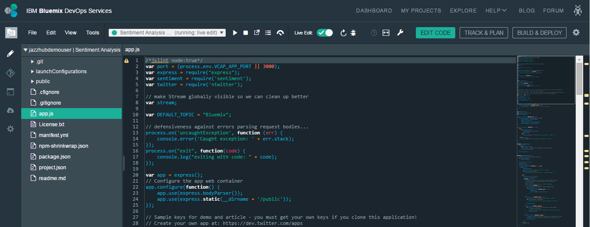

# Editing

Last updated: 16 July 2015

The Web IDE is a browser-based development environment that is focused on helping you develop for the web.  The IDE is built for JavaScript, HTML, and CSS development with support for content assist, code completion, and error checking powered by Tern.  However, the IDE is capable of working with nearly any language and also offers syntax highlighting [for most file types](https://hub.jazz.net/docs/overview/#dev_support).  The Web IDE includes built in source code management through Git or Jazz SCM, and the ability to deploy code locally to test and debug your apps.

All of these features, powered from the web.  Nothing to install, nothing to maintain, nothing to scale, and it travels with you anywhere you have an internet connection.

---
* [Set up the editor](#editorsetup)
* [Edit code](#editcode)
* [Source control](#sourcecontrol)
* [Deploy from workspace](#deploy)
* [Use command line Shell](@shell)
* [View logs](#logs)
* [Edit with your favorite tools](#editlocal)


---
<a name='editorsetup'></a>
###Set up the editor

The configuration of a code editor can be a deeply personal thing.  Whether it be simple visual color schemes, or technical tools and settings, the Web IDE strives to be completely customizable to meet all of your development needs.

View and edit settings for the Web IDE by selecting the **Settings** icon  from the navigation bar.

| Categories | Description  |
|---|---|
| Cloud Foundry  | Define a Cloud Foundry API and Manage URL  |
| CSS  | Define the severities for CSS linting rules that will be used when checking your code within the Web IDE  |
| Editor Settings  | Configure editor-specific settings for key bindings, editor behavior, layout, and more  |
| Editor Styles  | Configure color schemes for the languages that you use, or import an existing theme from other popular editors  |
| Git  | General settings for using Git  |
| JavaScript Validation  | Define the severities for JavaScript linting rules that will be used when checking your code within the Web IDE  |
| Plug-ins  | [Install](https://wiki.eclipse.org/Orion/How_Tos/Installing_A_Plugin), disable, or remove plug-ins from the editor  |
| Tern  | View a list of all of the Tern code analysis plug-ins that are loaded in the editor |
	
For some settings, the ability to toggle them on and off quickly can be invaluable.  The Web IDE provides the **Local Editor Settings** button  at the top of the editor to provide quick access to the settings you need the most.


Editor Style and font size are always shown by default.  To include other Editor settings in the menu:
1. Click the **Local Editor Settings** button  to view the menu.
2. Select **Editor Settings...** from the menu.
3. Toggle the circle next to the setting name to include or exclude it from the **Local Editor Settings** menu.


---
<a name='editcode'></a>
###Edit code

The Web IDE is made up of two main sections.  The first is the file navigator on the left, which shows the file tree structure of your project.  From here, you can perform file management actions such as creating files and folders, renaming, deleting, etc.  These actions can be accomplished from the menu bar or by right-clicking within this section. You can even drag and drop files from your local computer into the file navigator to upload them.  The second section is the editor window on the right.  The editor provides a number of features to help make coding easier, such as content assist, and syntax validation.



####Open a file to edit
1. To edit code in the IDE, expand the file tree for your project in the file navigator.
2. Click on a file to open it within the editor.

Alternatively, `Ctrl+Shift+F` can also be used to search for and open a file directly from the editor.

####Working with multiple files
1. To work with two files at the same time, select the **split editor mode** button  from the top of the editor.
2. Select a view to decide how the files are displayed in the editor:
	*  Single Page
	*  Split Vertical
	*  Split Horizontal
	*  Picture in Picture

 After you select a view, if a file was previously opened in the editor, it will now be displayed in both editor panes.

 To open or change a file that is displayed within one of the editor panes:
 1. Move the cursor to the editor pane you would like to change.
 2. Select a file from the file navigator.

####Keybindings
The Web IDE supports all of the basic functions you would expect from a text editor (cut/copy/paste, undo/redo) in addition to a number of advanced features such as Content Assist `Ctrl+Space` and the ability to see detailed information about the functions you use, simply by hovering over them.  Most of these commands are accessible only through keyboard shortcuts.

To see a full list of available keyboard commands in the editor:
* Press `Alt+Shift+?` or `Ctrl+Shift+?` on Mac OS.
* Click **Help** and select **IDE Keyboard Shortcuts** from the menu.

Outside of the editor, you can get the same help on any page by pressing `Shift+?`.

---
<a name='sourcecontrol'></a>
###Source Control
Integrated source code management tools are accessible from the left action menu.
* If your project is sourced in Git, select the Git icon  from the navigation bar to access the Git interface from the Web IDE.  For more information, see [Source control with Git](../git/)
* If your project is sourced in Jazz, select the Jazz icon  from the navigation bar to access the Jazz interface from the Web IDE.


---
<a name='deploy'></a>
###Deploy from workspace

1. To deploy your app, select an existing launch configuration from the run bar, or [create a new launch configuration](https://hub.jazz.net/tutorials/livesync/#launch_configuration)
1. Click the deploy icon  on the run bar. 
2. After your app is deployed, you can also complete any of these actions:


 * Stop the app.
 * Open the deployed app.
 * View the logs of the deployed app.
 * Open the app's Dashboard.
 * If you are developing a Node.js app, enable Live Edit mode.
 
 When you click the deploy icon, an instance of your app is deployed by using the current contents of your workspace and the environment that is defined in your launch configuration.
 
---
<a namee='shell'></a>
###Use command line Shell
The Web IDE provides quick access to a command line shell to perform any of the following actions:
* Interact with Cloud Foundry compatible targets
* Edit files within your projects directory
* Manage editor plug-ins
* View plug-in contributions for a service


To access the Shell, click the **Shell** icon  from the left action bar.

---
<a name='logs'></a>
###View Logs

* To view logs for your locally deployed app, click the **Open Logs** icon  from the run bar.  A live scrolling view of the logs will open in a new window.
* To stop the log view from scrolling continuously, click the scroll lock slider  from the top of the window.
* To clear all existing logs from the view, select the **clear** button  from the top of the window.

---
<a name='editlocal'></a>
###Edit with your favorite tools

If you would prefer to use tools outside of the Web IDE, DevOps Services offers Bluemix Live Sync. Bluemix Live Sync is a command line application that can be used to synchronize changes that are made in your local file system back to your cloud workspace on Bluemix DevOps Services.  This allows you to work directly with your project files by using any tool that you like.

**Before you begin**: [Download and install the Bluemix Live Sync command-line interface](http://livesyncdownload.ng.bluemix.net).


<a name='edit_local_download'></a>
###Synchronize your local environment with Bluemix

1. Open a command-line window.
2. Sign in to Bluemix by typing your IBM id and password:
```
bl login
```
3. View a list of your Bluemix projects: 
```
bl projects
```
4. Synchronize your local environment with your project on Bluemix:
```
bl sync projectName
```
where `projectName` is your Bluemix app's name.

By synchronizing your local environment with Bluemix, you populate `localDirectory` with the files from your DevOps Services project. When you are finished making changes, type `q` to end synchronization.

###Enable the Desktop Sync feature to edit code locally

The Desktop Sync feature is like Live Edit mode for the command line. To debug on the command line, you must enable the Desktop Sync feature.
1. In another command-line window, enable the Desktop Sync feature:
```
cd localDirectory
bl start
```
2. Use the launch configuration that you created in the Web IDE. After you select the launch configuration, Desktop Sync is enabled in your local environment. In the command-line window that you just opened, you can view the app's URL, the debug URL, the manage URL, and view the Bluemix Live Sync state.

3. Refresh the browser and verify that you can see the changes that you saved to static files in the local workspace. 

###Disable the Desktop Sync feature

1. In the second command-line window, enter `bl stop`.
2. In the first command-line window, press `q`.
