[Back to Track & Plan](../)

#Explore the Track &amp; Plan feature

Last modified: 24 October 2014

You can use the Track &amp; Plan feature in IBM&reg; Bluemix&trade; DevOps Services to manage any type of project, large or small.

To explore the feature, [start at the beginning][1] or click any text or image.

 |  | 
 --- | --- | ---
[**1. Navigate between views**][1] | [**2. Find work items**][2] | [**3. Display work items by state**][3]
<a href="./page1"> 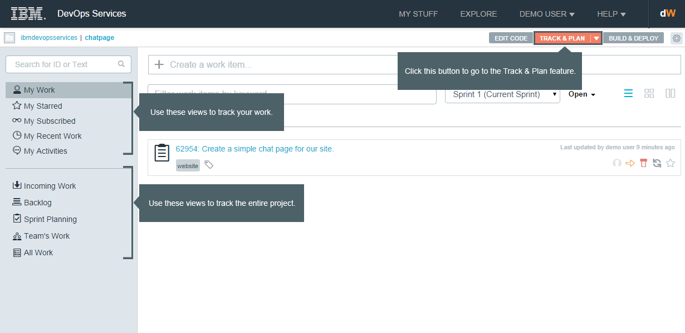</a> | <a href="./page2"> 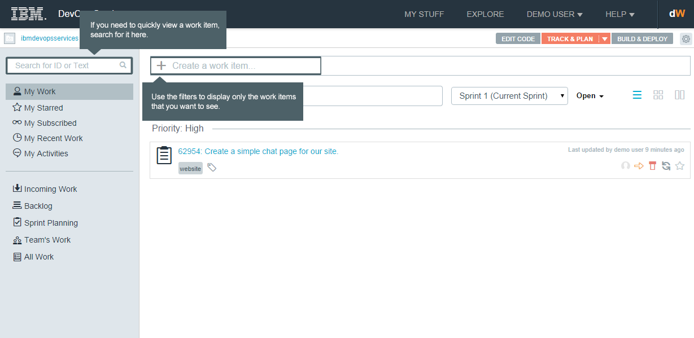</a> | <a href="./page3"> 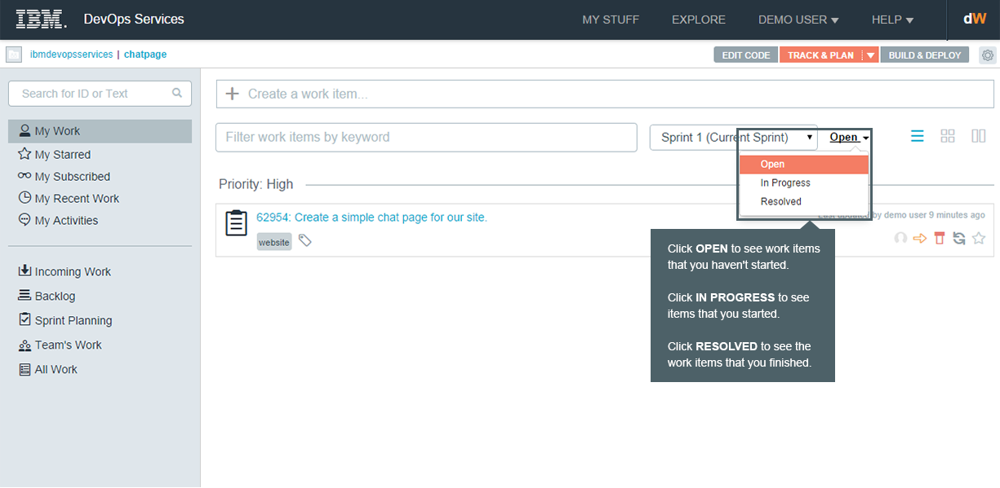</a>
[**4. Display work items in a list**][4] | [**5. Display work items in a grid**][5] | [**6. Display work items grouped by state**][6]
<a href="./page4"> 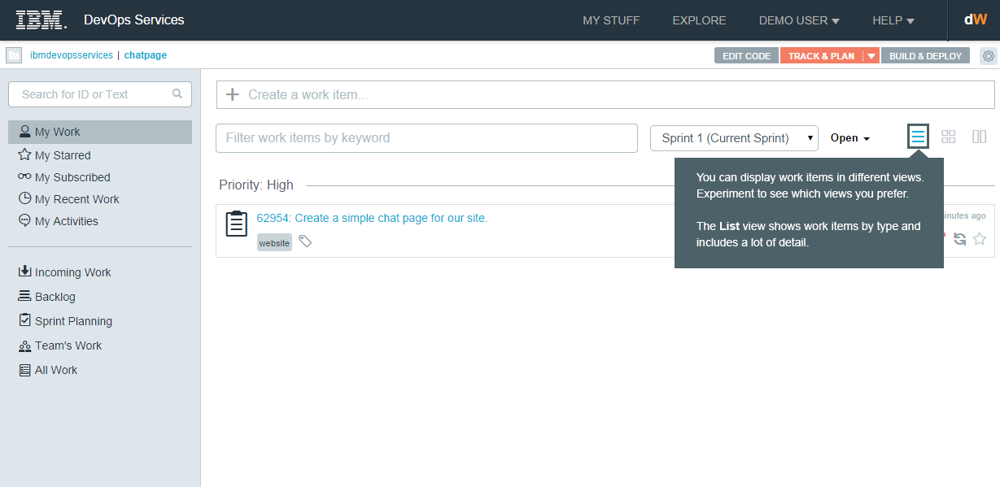</a> | <a href="./page5"> 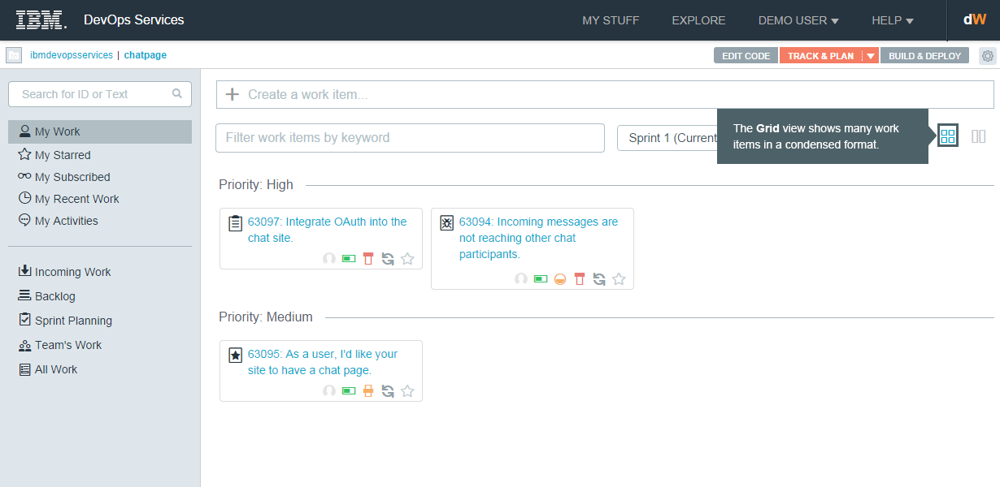</a> | <a href="./page6"> 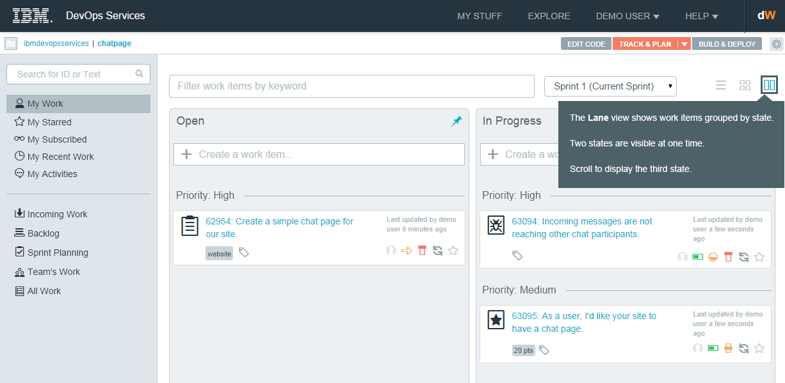</a>
[**7. Create work items in the My Work view**][7] | [**8. Set attributes when you create a work item**][8] | [**9. Triage work items**][9]
<a href="./page7"> 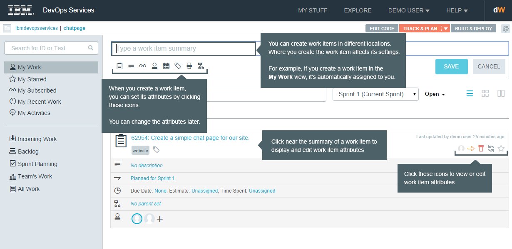</a> | <a href="./page8"> 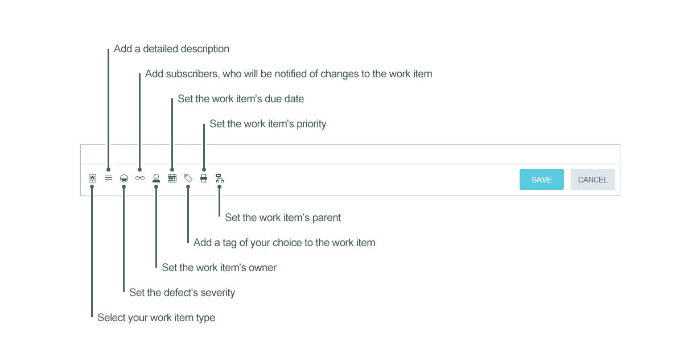</a> | 
[**10. Set attributes in the Incoming Work view**][10] | [**11. Rank work items**][11] | [**12. Assign work items to a sprint**][12]
<a href="./page10"> 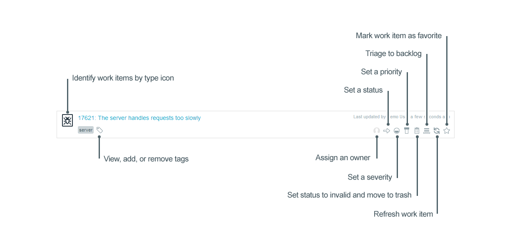</a> | <a href="./page11"> 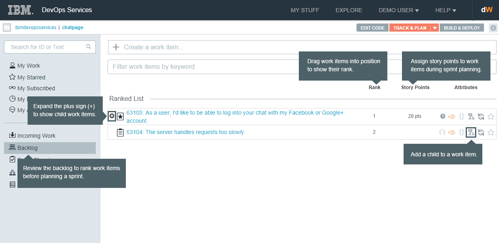</a> | <a href="./page12"> 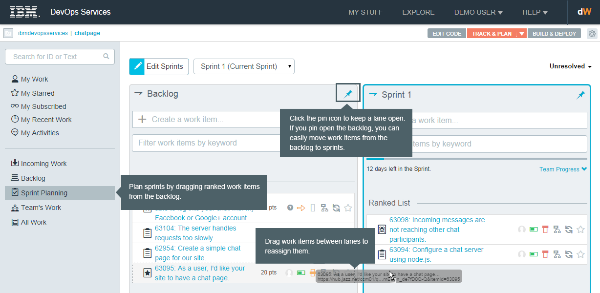</a>

&copy; Copyright IBM Corporation 2013, 2014.

[1]: ./page1
[2]: ./page2
[3]: ./page3
[4]: ./page4
[5]: ./page5
[6]: ./page6
[7]: ./page7
[8]: ./page8
[9]: ./page9
[10]: ./page10
[11]: ./page11
[12]: ./page12

