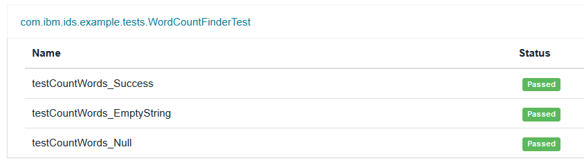

#Deploy an app from a basic pipeline in Bluemix DevOps Services

###### Last updated: 20 August 2015

Time: 30 minutes

In this tutorial, you create your own version of an IBM&reg; Bluemix&trade; DevOps Services project by forking a project to your space. Then, in your project, you set up a basic pipeline that you can use to build and deploy a Java&trade; app to test and production environments.

 <table>
   <tr>
     <td colspan="6"><h4>Summary of steps</h4></td>
   </tr>
   <tr>
     <td><a href="#before_begin">Before you begin</a></td>
     <td><a href="#fork_app">Fork a sample project</a></td>
     <td><a href="#build_stage">Create a build stage</a></td>
     <td><a href="#deploy_stage">Create a deployment stage</a></td>
     <td><a href="#deploy_app">Run the stages</a></td>
     <td><a href="#summary">Summary</a></td>
   </tr>
 </table>

##Before you begin

1. [Sign up for DevOps Services](https://hub.jazz.net/register). When you sign up, you'll create an IBM id, create an alias, and register with IBM&reg; Bluemix&trade;. 

2. Optional: Add the IBM Continuous Delivery Pipeline for Bluemix (the Delivery Pipeline service) to your Bluemix space so that you can continue to use it beyond the free monthly build time.  

   a. [Open the Bluemix Catalog](https://console.ng.bluemix.net/?ace_base=true/#/store/cloudOEPaneId=store). From the **Category** list, select **DevOps**.

   b. Click **Delivery Pipeline**.

   c. Leave the default settings as they are; then, click **CREATE**.

##Fork a sample project

To quickly get started developing, fork a sample project named WordCounter. WordCounter is a Java app that uses Jazz&trade; source control management (SCM) and contains a manifest file for deploying to Bluemix. The app is a simple form where you can type a sentence and have the number of words in that sentence counted for you.

1. [Open the WordCounter project in DevOps Services](https://hub.jazz.net/project/ibmdevopsservices/WordCounter/overview). 
2. On the  Overview page, click **FORK PROJECT**. 

3. When you are prompted, enter a unique name for your project. Then, click **CREATE**.

A new project is created with a copy of the code from the sample project. You're ready to build and deploy.

##Create a build stage
The goal is to set up the pipeline so that every time a change is delivered to the project, a build runs. The Java source files are built and stored in an output directory. By creating the build as the first in a sequence of stages, the build will run first. Later, you will create a deployment stage that will begin after the build completes successfully.

**Important:** You can complete this tutorial for free because a project is granted 60 minutes of free build time per month. If you exceed those 60 minutes, you might generate charges to your Bluemix account. For more information about Bluemix, DevOps Services, and charges, [see Configuring Bluemix billing for Bluemix DevOps Services](/docs/reference/billing/).

1. Click **BUILD & DEPLOY**. 

2. On the Build & Deploy Pipeline page, click **ADD STAGE**. The Stage Configuration page opens. A stage is a grouping of one or more jobs. 

    
3. Click the default **MyStage** name and change the name of the stage to `Build`. 
    
4. On the **INPUT** tab, enter the password for your IBM id.  You can use the default settings for the remaining fields, which use these configurations:
      * The input for the build is the content in the project's Jazz SCM repository. 
      * The Build stage runs automatically every time a change is pushed to the repository. 

5. On the **JOBS** tab, click **ADD JOB**. A job contains a set of execution instructions. The build stage will contain one build job.
  
6. Select **Build**, and for the builder type, select **Ant**. The WordCounter app contains an Ant build.xml file that contains the build configuration information.
    
7. In the **Working Directory** field, type the name of the folder that contains the `src` code, which in this app is `WordCounter`. 
    
8. In the **Build Archive Directory** field, type the name of the directory where the build output files can be archived as part of the build result; for example, `WordCounterArchive`.
    
9. Select the **Enable unit tests** check box so that you can review test cases after a build. In the `tests` directory, the WordCounter app contains the com.ibm.ids.example.tests.WordCountFinderTest unit test.
    
10. Click **Save**. 

##Create a deployment stage

Next, create a stage that deploys your app to Bluemix, so that after a successful build stage runs, the deployment stage begins and deploys the build output to Bluemix. If the build stage does not complete successfully, the deployment stage does not run.

1. Click **ADD STAGE**. The Stage Configuration page opens. Stages run sequentially, so this stage will run after the build stage

   
2. Click the default **MyStage** name and change the name of the stage to `Deploy to dev`.
    
3. On the **INPUT** tab, use the default settings, which use these configurations:
    
     * The input for the deployment is the output from the build stage. 
     * The deployment stage runs automatically every time the build stage runs successfully. 
    
4. On the **JOBS** tab, click **ADD JOB** and then select **Deploy**. 

  * The deployment stage will contain one deployment job. 
  * This job uses the settings in the `manifest.yml` file, which is included as part of the sample project. 
  * The **Deployer type** is Cloud Foundry by default. You can also choose to deploy to a container instead, where the app and its dependencies can run as an isolated process on the host operating system.
  * You can use all of the other values as they are provided, except for the hostname. The hostname defines your app's URL and must be unique for each app that is deployed on Bluemix. 
     
     a. In the `cf push` command, override the hostname with the `-n` option. Example: `cf push "${CF_APP}" -n MySampleWordCounter-App-DemoUser02102015` 

     **Tip:** Use a combination of your user name and the date or time to ensure that your route is unique.

5. Click **SAVE**.
 

##Run the stages
Build and deploy your project for the first time to test them. You don't have to wait for someone to deliver code changes to trigger the builds, though they are set up to automatically run.

1. At the top of the Build stage, click the **Run Stage** icon. Watch how the Deploy stage begins after the Build stage completes. The build and deploy process might take a couple of minutes. When you see a green circle by the app link, the app is live.  

2. Verify that the app is running by clicking the app link. 

   Note: If you click the white area around the link, the dashboard for the app opens in Bluemix.
3. Review the unit tests.

  a. In the Build stage, click the **Last execution result** section. 
 
  b. Click the **TESTS** tab and the com.ibm.ids.example.tests.WordCountFinderTest unit test.
  
  c. Verify that the tests passed.
  

  

##Summary
You created a basic build and deployment pipeline for a sample project. You are ready to create builds and deployments for your projects. 

##Next steps

* To learn more about the pipeline, [see Build & Deploy](/docs/reference/deploy/). 
* To learn about IBM Containers, [see the Containers documentation on Bluemix](https://www.stage1.ng.bluemix.net/docs/starters/index-gentopic3.html#container_ov).
* To learn about using the Delivery Pipeline service with containers, [see How to set up continuous delivery for IBM Containers](https://developer.ibm.com/bluemix/docs/set-up-continuous-delivery-ibm-containers/).
