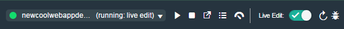
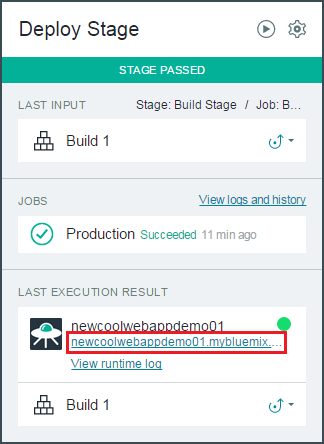

#Get started: Create, edit, and deploy an app

######Last updated: 16 December 2015

Time: 30 minutes

Learn how to use IBM&reg; Bluemix&trade; DevOps Services to plan, code, build, and deploy to the IBM&reg; Bluemix&trade; platform in an agile, integrated way. To get the most out of this tutorial, first watch the related video, which was created by a DevOps Services expert, Adam Archer.
 
&nbsp;&nbsp;&nbsp;<a href="https://www.youtube.com/watch?v=VJesera9jR0" target="_blank">An Overview of IBM Bluemix DevOps Services</a>

 <table>
   <tr>
     <td colspan="5"><h4>Summary of steps</h4></td>
   </tr>
   <tr>
     <td><a href="#prereq">Before you begin</a></td>
     <td><a href="#grow">Grow your project</a></td>
     <td><a href="#team">Work as a team</a></td>
     <td><a href="#deploy">Deploy to production</a></td>
     <td><a href="#summary">Summary</a></td>
   </tr>
 </table>

##Before you begin

To do this tutorial, you need a Bluemix account. Bluemix accounts provide access to everything you need to develop, track, plan, and deploy apps. You can sign up for a free 30-day trial. 

<h5> </h5>

   

		<a href="https://login.jazz.net/psso/proxy/jazzregister?redirect_uri=https%3A%2F%2Fhub.jazz.net%2F" target="_blank" alt-text="Sign up"> 
			
SIGN UP
for Bluemix 

			

		</a>
   

<!-- Adam's video starts on the Bluemix Dashboard. If you haven't signed up for DevOps Services or Bluemix yet, here are some pointers.-->
<!--   On the Bluemix website, you can find the [Bluemix Overview](https://www.ng.bluemix.net/docs/#overview/overview.html#overview) to help you better understand the Bluemix platform. -->

##Get started

Create a sample app, add a Git repository for source control, edit in Live Edit mode, and deploy to Bluemix. This section of the tutorial corresponds to Part 1 of the related video.
 

### Create a sample app
    
[Sign in to Bluemix](https://www.ng.bluemix.net). The Dashboard opens, which is where Adam's video begins.

<!-- The Dashboard shows an overview of the active Bluemix space for your organization. 
By default, the space is `dev` and the organization is the user name of the person who created the project. 
For example, if `bob@example.com` logs in to Bluemix for the first time, the active space is `dev` and the organization 
is `bob@example.com`.
If you create more organizations or spaces in Bluemix, use the same ones as you follow the tutorials. Use the default selections. -->

1. Click **CREATE APP** and then click **WEB**.  

2. Click **SDK for Node.js** and then click **CONTINUE**.

3. Name your app and then click **FINISH**. The name is a unique URL where you access your app. 

After a moment, the app starts. The app's Dashboard opens. You can see the app running by clicking **Overview** in the left navigation bar.

<!-- 
Now that your app is running, you can see and modify the code by using DevOps Services.-->

###Set up Git integration and auto-deploy in DevOps Services

You can work with your app's code in many ways. For example, with auto-deploy, you can modify the code that runs in your app by pushing your changes to a Git repository. You can auto-deploy your code if you use the Build & Deploy capabilities of DevOps Services.

1. To enable auto-deploy, go to your app's Overview page on the Bluemix Dashboard and click **ADD GIT**. A Git repository is created and is populated with example code and a deployed app. You might be prompted to enter your password to verify that DevOps Services can act on your behalf. 

2. Make sure that the **Populate the repo with the starter app package and enable the Build & Deploy pipeline** check box is selected.

You created a Git repository, populated it with the example code, and deployed the app.

3. Click the URL under your apps name to view the deployed app, or click **EDIT CODE** to start working with your code.  Your new project opens in the web integrated development environment (Web IDE).  

### Edit the app in Live Edit mode

  For Node.js apps, you can make changes to static files, such as HTML or CSS, and immediately propagate the changes to the deployed app by using Bluemix Live Sync.

1. Go to the app's Overview page in Bluemix and click **EDIT CODE**. When you clicked **ADD GIT**, that link was replaced by **EDIT CODE**. Your new project opens in the Web IDE.  
<!-- -->

2. In the Web IDE, enable Live Edit mode.  You  can now make changes to your code in the Web IDE and see the changes reflected in the running app.

 The Web IDE deployment uses files in the project's cloud workspace. 

 
4. To see your updated static files, refresh the deployed app in the browser.  

   If you update a node module, use the **Restart the App Without Redeploying** icon to restart the node run time in seconds, without redeploying the app.
 
5. To try Live Edit mode, in the file directory, click `public/index.html`.  Change "Hi there!" to "Hi there! More title text!". When you refresh the browser, you can see the changes in the deployed app.  

**Note:** In the video, Adam edits the `views/body.jade` file.  However, because that file is no longer in the starter pack, you'll edit the `public/index.html` file to get the same results.

<!-- You can use the Debug feature to create breakpoints and inspect variables in your node modules so you can isolate problem areas as you work. -->
 
 You can also do this kind of live editing and quick refresh by using the Desktop Sync feature. [For more information, see 
Bluemix Live Sync](https://www.ng.bluemix.net/docs/develop/bluemixlive.html).

### Deploy automatically with Git push

1. Push the change by using the integrated Git support. 

	a. From the Web IDE menu, click the **Git Repository** icon.
	
	b. In the Working Directory Changes section, select the changed files.

	c. Type a commit message that explains your changes. Click **Commit** to put the changes in the local master branch.
	
	d. Put these changes in the origin/master branch by clicking **Push**.

2. To verify that your new code was deployed, 
go to the **Build & Deploy** Pipeline page and wait until you see that the deploy stage has completed successfully. Then, click the URL link located in the *Last Execution Result* section of the Deploy stage. Your updated app is shown.

## Grow your project

Grow the app into a robust project that has members, sprints, and a backlog. This section of the tutorial corresponds to Part 2 of the related video.

### Invite a team member
1. In the upper-left corner, click the project name to open the project's Overview page.
2. Click **MEMBERS** and then click **INVITE MEMBERS**.
3. Enter the email address of the team member to invite and then click **INVITE**. 

 
### Create a task backlog
1. In the upper-right corner,  click **TRACK & PLAN**.

2. If you need to enable the Track & Plan feature for this project, click the **Settings** icon in the upper-right corner.

3. Click **OPTIONS**.  Select the **Enable Track & Plan** check box and then click **SAVE**.

4. Click **TRACK & PLAN** again. In the left navigation bar, 
click **SPRINT PLANNING**.

5. In the backlog lane, add a few work items.  In the **Type a a work item summary**  field, type a summary, and then press Enter.  Click **CREATE**.
Create three work items to get the team started:

   * Update the title of the page
   * Add a new paragraph of text
   * Update the image

### Create and plan a sprint

1. Create a sprint by clicking  **Add Sprints** and then clicking **CREATE**. You might need to refresh your window to see the new Sprint 1 lane.

2. Update the **Planned For** field by dragging the task from the Backlog lane to the Sprint 1 lane.

## Work as a team

Members of the team can develop code independently and share changes when the changes are ready. This section of the tutorial corresponds to Part 3 of the related video.

### Accept the invitation to join the project 

1. If you receive an email invitation, you can join the project by clicking on the link in the email invitation to the project. Alternatively, new team members can sign in, click **My Projects**, and then click **INVITATIONS**.

2. Enter an alias to use and click **Finish**.

3. To deploy to Bluemix by using your own space, register for a free Bluemix trial.  Enter your phone number and click **Continue**.

2. Click **ACCEPT** to join the project.

3.  Click the project name to open the project.

### Start working on a task

1. Click **TRACK & PLAN** to plan  your work.
2. Click **SPRINT PLANNING**.  In the Sprint 1 lane, see the three work items.  The work item about updating the title is unassigned; assign it to yourself by clicking the question mark icon and selecting your name from the list. 

3. For the same work item, set the status:  click the right arrow icon next to the owner and select **Start Working**.  This work item is **In progress** because you are going to start working on it now.

### Develop independently

You can make changes to your code and see them in your personal space before you contribute your changes to the team.

1. Click **EDIT CODE**. A clone of the project is created in your project cloud workspace.

2. On the run bar, create your own launch configuration. From the **Create new launch configuration** list, click the create icon, which looks like a plus sign.
Because you want to deploy to the same account as the original project, get the ID and password for the for the project owner's Bluemix account.

3. In the Edit Launch Configuration window, change the host to be a unique name.

4. Because Live Edit mode is on, when you change the code, your changes are deployed automatically to your personal space while the original deployed app is unchanged.  For example, in the `public/index.html` file, change `Hi there` to `Hello`.  To see your version of the deployed app, on the run bar, click the **Open the URL** icon.

### Deliver your changes to the deployed app

Contribute your changes and make sure that the rest of your team can view your changes.

1. Click **EDIT CODE** to open the Web IDE. From the Web IDE menu, click the **Git Repository** icon.
2. In the **Commit** field, add a comment and include the task ID to link to the work item.
3. Select the file to commit.
4. Click **COMMIT**.
5. Click **PUSH**.
6. Verify that you see the commit in the work item:
	1. Click **TRACK & PLAN** and then click the work item.
	1. Click the **LINKS** tab.  In the Change Sets section, verify that you see the commit information.
8. Because you committed the change for this work item, change the status to **Complete** and click **SAVE**.
9. Verify that your latest change is on the official version of the deployed app.  

## Deploy to production

It's time to deploy your app! This section of the tutorial corresponds to Part 4 of the related video.

1. Make sure that you are logged in as the project owner, and click **BUILD & DEPLOY**.

2. Click **ADD STAGE** and name the stage `Production`.

3. Turn off auto-deploy by clicking **Run jobs only when this stage is run manually** in the **Stage Trigger** field.

4. Click the **JOBS** tab and then click **ADD JOB**. For the job type, select **Deploy**. 

5. Enter a new Bluemix space name:  in the **Space** field, click the arrow and then click **Create new space**. Type the new name and click **CREATE**. 

6. Give this deployment a unique host name by changing the deployment script.  Change the name parameter `-n` so that it is now `cf push "${CF_APP}" -n "new-name"`.  Click **SAVE**.

7. On the Production stage tile, trigger the first production deployment by clicking the **Run Stage** icon.

8. When the app is deployed, view the app running on production by clicking the deployed app URL on the Production stage tile.

## Summary

You now have a good overview of how to get started with DevOps Services.

You saw how to create and run a Node.js web app by using Bluemix and DevOps Services.
With one click, you created a Git repository, populated it with example code, and automatically 
deployed the app.  You then made a change and saw that the change was automatically deployed in Live Edit mode.

You grew your project by inviting another member, created a backlog of work items, and planned a sprint. Acting as a new project member, you accepted the invitation, started working on a task, made changes, and deployed to a separate Bluemix URL.  Then, you pushed the changed code and resolved the work item.  

Finally, as the project owner, you created a production stage and deployed to a production URL.

[1]: /tutorials/jazzeditor/images/runbar_green.png
