#Developing an application that uses Jazz source control

This tutorial shows how to develop an application that uses Jazz&trade; source control management (SCM). 
Ensure that your IBM id is registered with [IBM&reg; Bluemix&trade;](https://bluemix.net). Log in to IBM&reg; Bluemix&trade; DevOps Services with your IBM id.

---
##Start with a sample project

To start, you can work with an existing sample project that's set up for 
Jazz SCM and is ready to use: [SentimentJazzSCM](https://hub.jazz.net/project/curtispd/SentimentJazzSCM/overview).

Click **EDIT CODE**, which opens the Web IDE where you can load the `app.js` file and 
customize the application by changing its name on lines `110` and `114`. 
Notice that the Web IDE recognizes the file as a Javascript file and 
highlights everything for you.

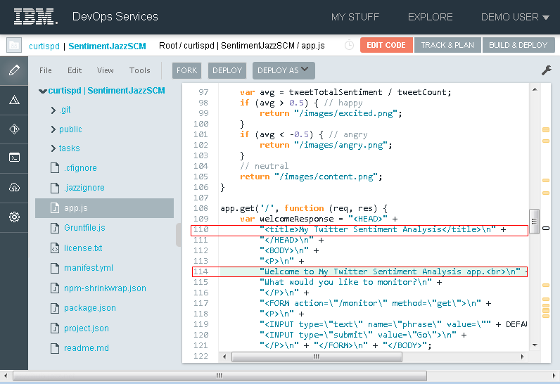

After you change the name, you can see your change by 
deploying the application to IBM Bluemix. 
To start a manual deployment, click **DEPLOY** from the menu. 
If you see a Configure Application Deployment dialog box, 
click **DEPLOY**. You can see the deployment information by 
clicking the `root folder page` link 
in the deployment message.

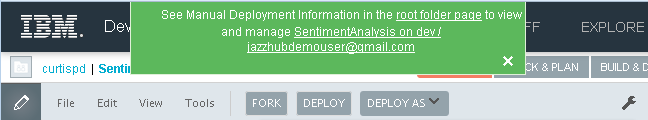

Now you see the manual deployment information.

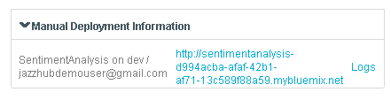

Click the application URL to see the running app with your changes.

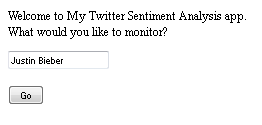

###Manifest file

To deploy a Bluemix DevOps Services project from the Web IDE, the project must have a 
`manifest.yml` file. 
This file contains important settings such as the application instance name,
the host computer, the services that the application uses, and more. 
This sample application contains the `manifest.yml` file.

---
##Fork the sample application

Instead of working off a shared code base, 
you can fork this code into your own project so that you have your own copy to work with. 
On the menu, click **FORK** and enter a name for your new project. 

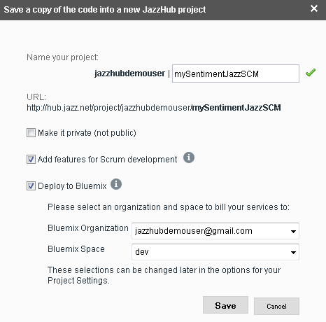

If you're getting an error, you might need to register with [Bluemix](https://bluemix.net). 
Otherwise, you're all set to edit your own project.

---
## Edit your own project code

Now, you can edit `app.js` in your own project, deploy the changes, and see them go live. 

Use the 
navigation tree to find the file that you modified before (for example, `app.js`) and 
edit it in the Web IDE. 

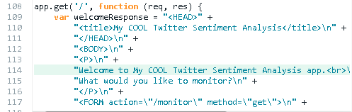

---
##Deliver changes to the Jazz SCM repository

After you make changes, 
you can deliver them to the Jazz SCM repository. 

You can use the integrated Jazz SCM support to check-in the change. 
Switch to the Jazz SCM Changes page and follow these steps:

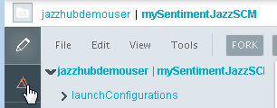

In the **Unresolved** section, expand the changed file to see the line that you changed:

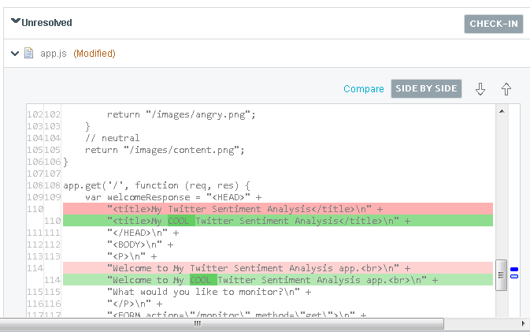

Check in the change:

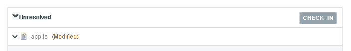

In the **Outgoing Change Sets** section, enter a comment to describe the change:

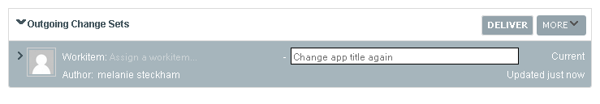

Deliver the change:

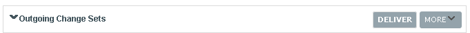
 
---
##Trigger auto-deployment

To trigger a deployment automatically every time that code is 
delivered to your remote project repository, 
you can turn on simple auto-deployment.

To turn on simple auto-deployment, go to the BUILD & DEPLOY page 
and click **SIMPLE**. 

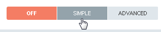

**Tip:** To go to the BUILD & Deploy page, either click **BUILD & DEPLOY** from the 
Web IDE or click the cloud 
icon in the left navigation bar.

Click **REFRESH** to show the status of your deployment in the **Logs** section. 
After a successful deployment, a URL link to the deployed application is displayed beside the 
**Deploy to** field on the page.

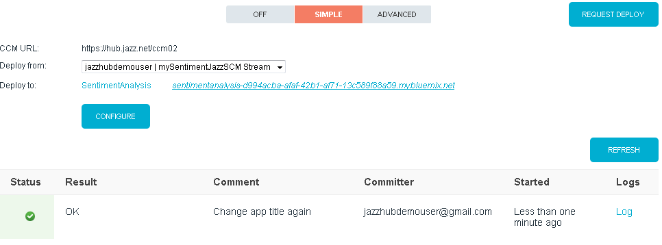

When you click that link, you can see your updated running application.

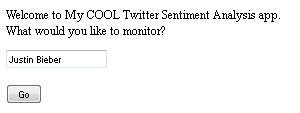

Click the app name link (for example, `SentimentAnalysis`) beside 
the **Deploy to** field to open 
the Bluemix application dashboard where you can manage your deployed app instance. 

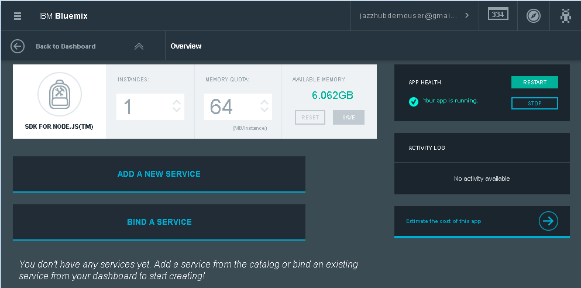

The Bluemix application dashboard has options to 
stop and restart
your app. You can use the
gear icon to perform more actions, such as deleting 
and renaming your app. 
You can connect an add-on 
such as Delivery Pipeline or Track & Plan. 
To find out more about these add-ons, see the associated tutorials.

---
##Summary

You should now have a good overview of how to develop an app that uses Jazz SCM. 

You've seen how to edit a sample app and fork that app by using Bluemix DevOps Services. 
With a few simple steps, you deployed your changed app and saw it 
running in the cloud.
In minutes, you changed the code, delivered the changes to the Jazz SCM repository 
by using the Web IDE, set up auto-deployments to trigger automatically when changes are
delivered to the stream, deployed the application, 
checked the deployment status, and ran the app to show your changes.

